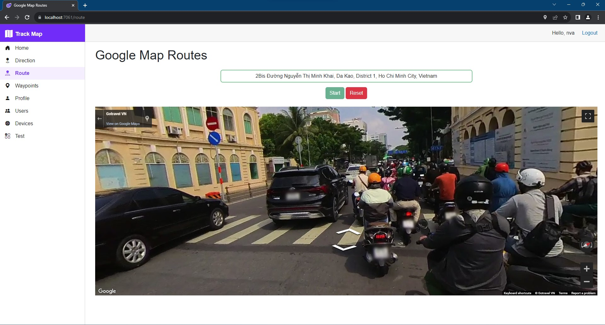

# TRACKMAP
An experimental real-time tracking that integrates the robust Google Maps API along with various libraries like Places, Directions, Routes, and Distance Matrix. This project is designed to provide a comprehensive tracking solution for various needs.

## IMAGE DEMO
<p align='center'>
</img>
</p>

## VIDEO DEMO
https://github.com/Tynab/TrackMap/assets/99815308/31365237-70c4-4d85-a4f4-027cdb6cbb5e

## CODE DEMO
```c#
public async Task GetCurrentPosition() => Position = (await Geolocation!.GetCurrentPosition(new PositionOptions()
{
    EnableHighAccuracy = true,
    MaximumAgeTimeSpan = FromHours(1),
    TimeoutTimeSpan = FromMinutes(1)
})).Location;
```